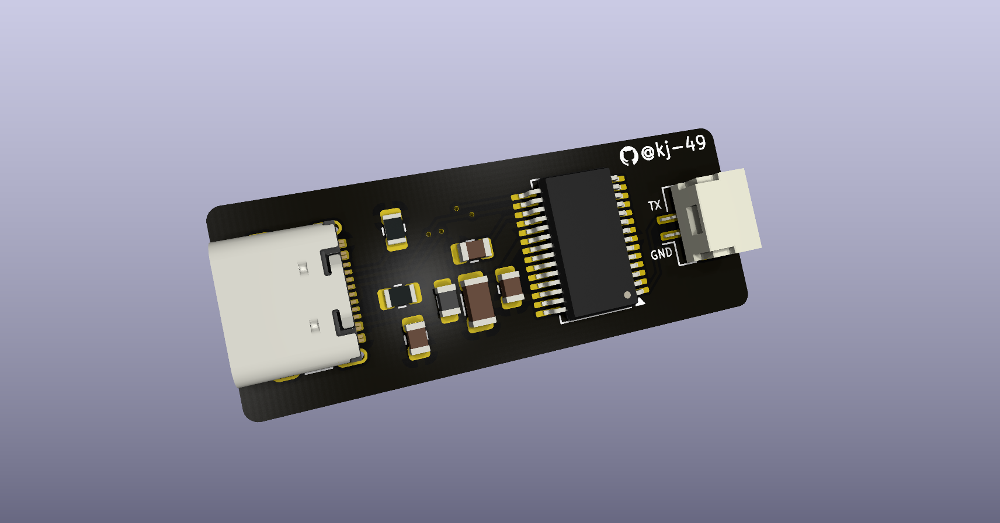

## UART to USB

A simple PCB that allows you to listen to microcontroller UART through a USB-C cable. Simply hook up your microcontroller TX and GND to the PCB, and open a serial listener like PuTTy to start viewing the data.

